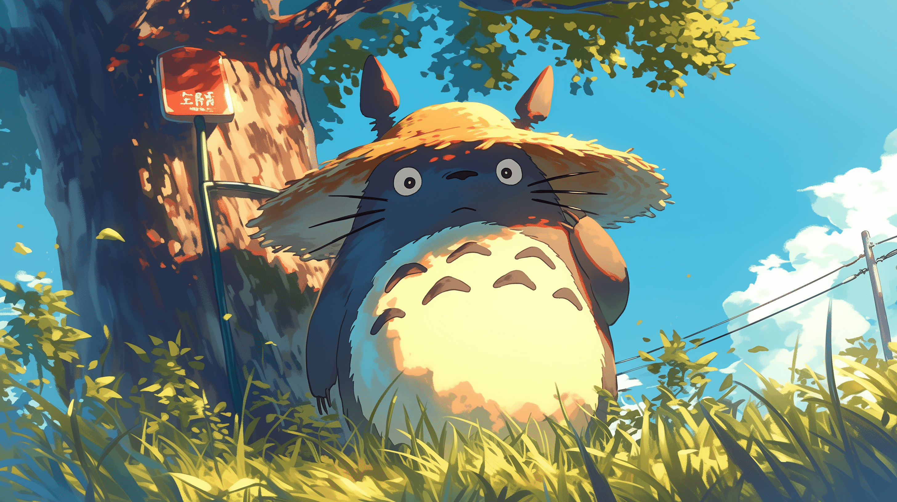

# Arch Linux Hyprland Dotfiles

minimal gruvbox rice for hyprland on arch Linux.

## 🛠️ System Setup

- **OS**: Arch Linux
- **WM**: hyprland
- **Launcher**: wofi
- **Terminal**: kitty
- **Lockscreen**: hyprlock
- **Background**: hyprpaper
- **Editor**: neovim (LazyVim with Gruvbox Dark)
- **Fetch Tool**: fastfetch
- **File Manager**: thunar
- **Status Bar**: none (it's bloat)
- **Notifications**: mako
- **Theme**: Gruvbox Dark
- **Icons**: Tela Circle
- **Font (UI)**: San Francisco
- **Terminal Font**: dejaVu Sans Mono
- **Shell**: zsh (with Powerlevel10k)

## 📸 Screenshots

## 🌄 Wallpaper

